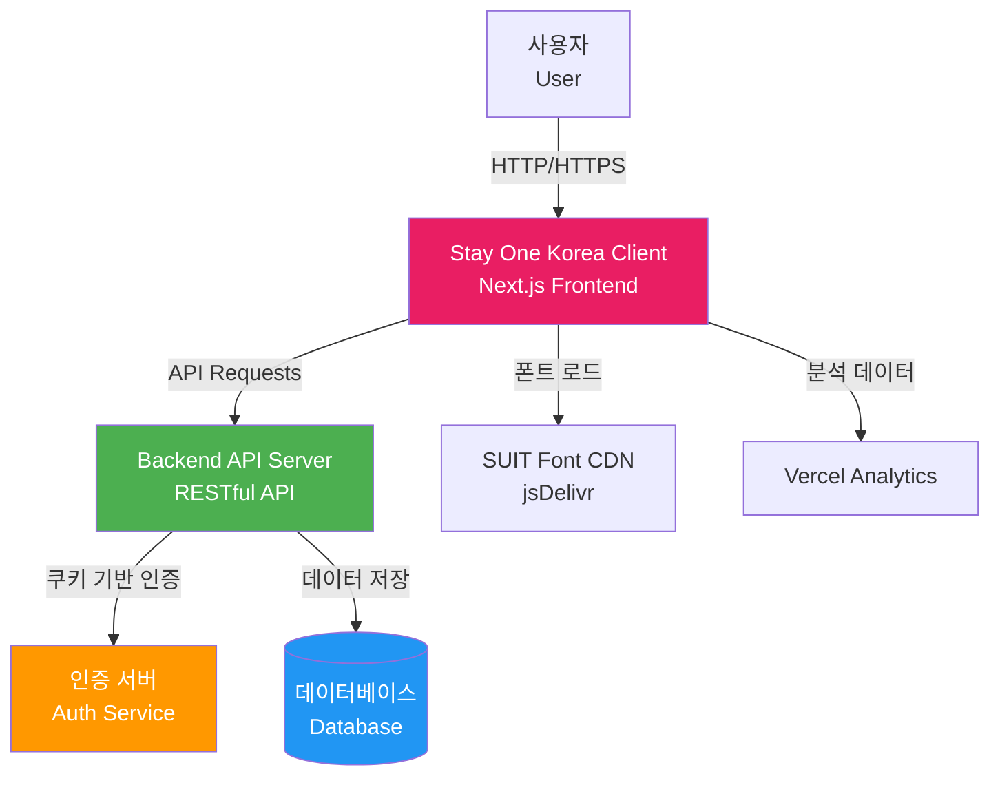
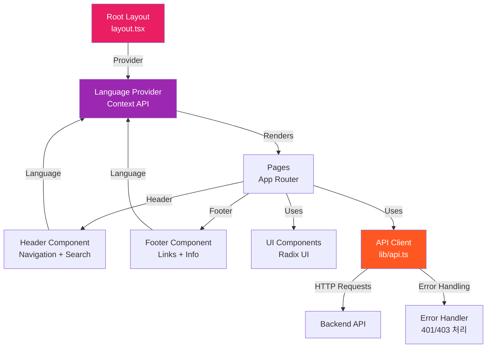
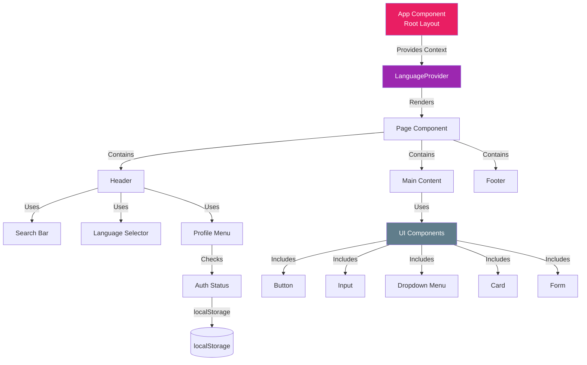
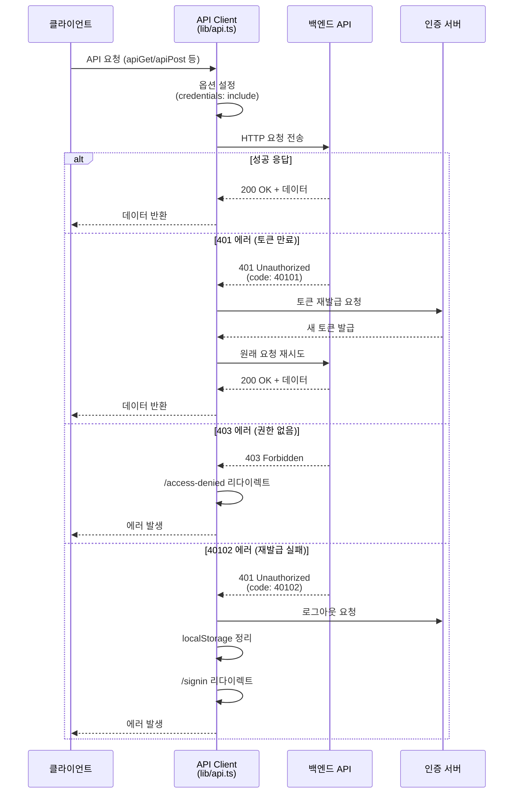
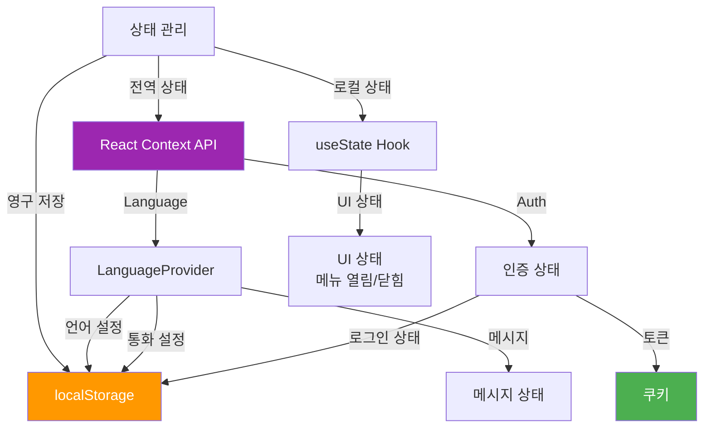
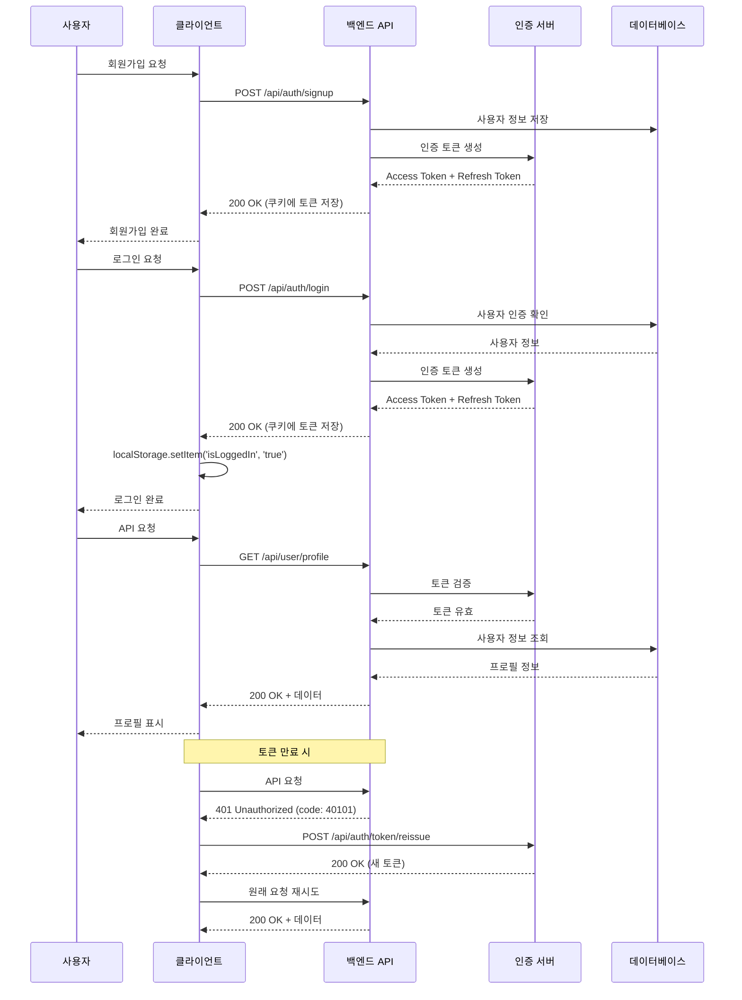

# Stay One Korea - 아키텍처 문서

## 📋 목차

1. [프로젝트 개요](#1-프로젝트-개요)
2. [시스템 아키텍처](#2-시스템-아키텍처)
3. [디렉토리 구조](#3-디렉토리-구조)
4. [주요 컴포넌트](#4-주요-컴포넌트)
5. [페이지 구조](#5-페이지-구조)
6. [API 통신 아키텍처](#6-api-통신-아키텍처)
7. [다국어 지원 (i18n)](#7-다국어-지원-i18n)
8. [스타일링 시스템](#8-스타일링-시스템)
9. [상태 관리](#9-상태-관리)
10. [보안 및 인증](#10-보안-및-인증)

---

## 1. 프로젝트 개요

### 1.1 프로젝트 소개

**Stay One Korea**는 한국의 아름다운 숙박시설을 소개하는 플랫폼입니다. 전국 각지의 특별한 숙소를 만나보고 예약할 수 있는 서비스를 제공합니다.

### 1.2 주요 기능

- **다국어 지원**: 한국어, 영어, 중국어, 프랑스어 지원
- **반응형 디자인**: 데스크톱(1200px+) 및 모바일(600px 이하) 최적화
- **사용자 인증**: 이메일 기반 회원가입 및 로그인
- **마이페이지**: 예약 관리 및 계정 설정
- **통화 지원**: USD, EUR, CNY, KRW 다중 통화 지원
- **실시간 검색**: 숙소 검색 및 필터링

### 1.3 기술 스택

#### 프론트엔드 프레임워크

- **Next.js 14.2.15** (App Router)
- **React 18.3.1**
- **TypeScript 5.x**

#### 스타일링

- **Tailwind CSS 4.1.9**
- **Radix UI** (접근성 있는 UI 컴포넌트)
- **SUIT Variable Font** (한국어 웹 폰트)

#### 상태 관리 및 폼

- **React Context API** (전역 상태)
- **React Hook Form 7.65.0**
- **Zod 3.25.76** (스키마 검증)

#### 국제화

- **Custom i18n Solution** (자체 구현)
- **localStorage** (언어/통화 설정 저장)

#### 개발 도구

- **ESLint** (코드 품질)
- **PostCSS** (CSS 처리)
- **Vercel Analytics** (분석)

---

## 2. 시스템 아키텍처

### 2.1 시스템 컨텍스트



### 2.2 프론트엔드 아키텍처



### 2.3 컴포넌트 계층 구조



---

## 3. 디렉토리 구조

```
stayOneKoreaClient/
├── public/                          # 정적 파일
│   ├── logo/                        # 로고 이미지
│   │   ├── desktop_logo.png
│   │   ├── mobile_logo.png
│   │   └── footer_logo.png
│   ├── icons/                       # 아이콘 이미지
│   │   ├── profile.png
│   │   ├── kor.png
│   │   ├── usa.png
│   │   └── info.png
│   └── *.svg                        # SVG 아이콘
│
├── src/
│   ├── app/                         # Next.js App Router
│   │   ├── layout.tsx               # 루트 레이아웃
│   │   ├── page.tsx                 # 홈 페이지
│   │   ├── globals.css              # 전역 스타일
│   │   ├── signup/                  # 회원가입 페이지
│   │   │   └── page.tsx
│   │   ├── signin/                  # 로그인 페이지
│   │   │   └── page.tsx
│   │   ├── account_check/           # 계정 확인 페이지
│   │   │   └── page.tsx
│   │   ├── verify-email/            # 이메일 인증 페이지
│   │   │   └── page.tsx
│   │   ├── email-verified/          # 이메일 인증 완료
│   │   │   └── page.tsx
│   │   ├── mypage/                  # 마이페이지
│   │   │   └── page.tsx
│   │   └── access-denied/           # 접근 거부 페이지
│   │       └── page.tsx
│   │
│   ├── components/                  # React 컴포넌트
│   │   ├── header.tsx               # 헤더 컴포넌트
│   │   ├── footer.tsx               # 푸터 컴포넌트
│   │   ├── language-provider.tsx    # 다국어 Provider
│   │   ├── loading.tsx              # 로딩 컴포넌트
│   │   ├── contants.ts              # 상수 정의
│   │   └── ui/                      # UI 컴포넌트
│   │       ├── button.tsx
│   │       ├── input.tsx
│   │       ├── card.tsx
│   │       ├── form.tsx
│   │       ├── label.tsx
│   │       ├── select.tsx
│   │       ├── dropdown-menu.tsx
│   │       ├── avatar.tsx
│   │       ├── badge.tsx
│   │       ├── checkbox.tsx
│   │       ├── separator.tsx
│   │       └── ...
│   │
│   ├── lib/                         # 유틸리티 라이브러리
│   │   ├── api.ts                   # API 클라이언트
│   │   └── utils.ts                 # 공통 유틸리티
│   │
│   ├── messages/                    # 다국어 메시지
│   │   ├── ko.ts                    # 한국어
│   │   ├── en.ts                    # 영어
│   │   ├── zh.ts                    # 중국어
│   │   └── fr.ts                    # 프랑스어
│   │
│   ├── types/                       # TypeScript 타입
│   │   └── index.ts                 # 타입 정의
│   │
│   └── middleware.ts                # Next.js 미들웨어
│
├── messages/                        # 루트 레벨 메시지 (중복)
│   ├── ko.ts
│   ├── en.ts
│   ├── zh.ts
│   └── fr.ts
│
├── package.json                     # 의존성 관리
├── tsconfig.json                    # TypeScript 설정
├── next.config.js                   # Next.js 설정
├── postcss.config.mjs               # PostCSS 설정
├── tailwind.config.ts               # Tailwind 설정
├── eslint.config.mjs                # ESLint 설정
└── README.md                        # 프로젝트 문서
```

### 3.1 주요 디렉토리 설명

#### `src/app/`

- Next.js 14 App Router 기반 라우팅
- 각 폴더가 하나의 라우트를 나타냄
- `layout.tsx`: 공통 레이아웃 (Header, Footer 포함)
- `page.tsx`: 각 라우트의 메인 페이지 컴포넌트

#### `src/components/`

- 재사용 가능한 React 컴포넌트
- `header.tsx`, `footer.tsx`: 공통 레이아웃 컴포넌트
- `language-provider.tsx`: 다국어 지원 Context Provider
- `ui/`: Radix UI 기반 기본 UI 컴포넌트

#### `src/lib/`

- 유틸리티 함수 및 헬퍼
- `api.ts`: API 클라이언트 (인증, 에러 처리 포함)
- `utils.ts`: 공통 유틸리티 함수

#### `src/messages/`

- 다국어 메시지 파일
- 각 언어별로 모든 UI 텍스트 정의
- 중앙 집중식 메시지 관리

#### `src/types/`

- TypeScript 타입 정의
- API 응답, 폼 데이터, 공통 타입 등

---

## 4. 주요 컴포넌트

### 4.1 Header Component

**위치**: `src/components/header.tsx`

**역할**:

- 전역 네비게이션 바
- 검색 기능
- 언어/통화 선택기
- 프로필 메뉴 (로그인 상태에 따라 다르게 표시)
- 모바일 반응형 햄버거 메뉴

**주요 기능**:

```typescript
// 로그인 상태 확인
useEffect(() => {
  const checkLoginStatus = () => {
    const localLoginStatus = localStorage.getItem('isLoggedIn') === 'true'
    // 쿠키에서 토큰 확인
    const cookies = document.cookie.split(';').reduce(...)
    const hasToken = !!(cookies.access || cookies.refresh)
    setIsLoggedIn(hasToken || localLoginStatus)
  }
  checkLoginStatus()
}, [])
```

**반응형 디자인**:

- **Desktop (≥1200px)**: 전체 네비게이션, 검색바, 프로필 메뉴 표시
- **Mobile (<1200px)**: 로고 + 햄버거 메뉴, 슬라이드 다운 메뉴

### 4.2 Footer Component

**위치**: `src/components/footer.tsx`

**역할**:

- 회사 정보 표시
- 법적 고지 및 링크
- 다국어 지원

**포함 정보**:

- 회사명, 사업자등록번호, 대표자명
- 통신판매신고번호
- 고객센터 정보
- 개인정보처리방침, 이용약관 링크

### 4.3 Language Provider

**위치**: `src/components/language-provider.tsx`

**역할**:

- 다국어 지원 전역 상태 관리
- 언어 및 통화 설정
- 메시지 파일 관리
- 전화번호 포맷 관리

**지원 언어**:

- 한국어 (ko)
- 영어 (en)
- 중국어 (zh)
- 프랑스어 (fr)

**지원 통화**:

- USD (미국 달러)
- EUR (유로)
- CNY (중국 위안)
- KRW (한국 원)

**상태 관리**:

```typescript
interface LanguageContextType {
  currentLanguage: (typeof languages)[number];
  setCurrentLanguage: (language: (typeof languages)[number]) => void;
  currentCurrency: (typeof currencies)[number];
  setCurrentCurrency: (currency: (typeof currencies)[number]) => void;
  messages: any;
  phoneFormat: typeof phoneFormats.ko;
}
```

**localStorage 연동**:

- 선택한 언어/통화를 localStorage에 저장
- 페이지 새로고침 시에도 설정 유지

### 4.4 UI Components

**위치**: `src/components/ui/`

**기술 스택**: Radix UI + Tailwind CSS

**주요 컴포넌트**:

#### Button (`button.tsx`)

- Variants: default, secondary, outline, ghost, link, destructive
- Sizes: sm, md, lg, xl
- CVA (Class Variance Authority) 사용

#### Input (`input.tsx`)

- 접근성 있는 입력 필드
- 다크 모드 지원
- Tailwind 스타일링

#### Form (`form.tsx`)

- React Hook Form + Zod 통합
- 폼 검증 및 에러 메시지 표시
- 접근성 고려

#### Dropdown Menu (`dropdown-menu.tsx`)

- Radix UI 기반
- 키보드 네비게이션 지원
- 포털 렌더링

---

## 5. 페이지 구조

### 5.1 페이지 라우팅 구조

```mermaid
graph TD
    Root[/] -->|Home| HomePage[홈 페이지<br/>page.tsx]

    Root -->|Sign Up| Signup[회원가입<br/>/signup]
    Root -->|Sign In| Signin[로그인<br/>/signin]
    Root -->|Account Check| AccountCheck[계정 확인<br/>/account_check]

    AccountCheck -->|Email Verification| VerifyEmail[이메일 인증<br/>/verify-email]
    VerifyEmail -->|Success| EmailVerified[인증 완료<br/>/email-verified]

    Root -->|My Page| MyPage[마이페이지<br/>/mypage]

    Root -->|Access Denied| AccessDenied[접근 거부<br/>/access-denied]

    style Root fill:#E91E63,color:#fff
    style HomePage fill:#4CAF50,color:#fff
    style Signup fill:#2196F3,color:#fff
    style MyPage fill:#FF9800,color:#fff
```

### 5.2 주요 페이지 설명

#### 홈 페이지 (`/`)

- **파일**: `src/app/page.tsx`
- **역할**: 메인 랜딩 페이지
- **기능**:
  - 환영 메시지
  - 숙소 탐색 버튼
  - 호스트 등록 버튼

#### 회원가입 페이지 (`/signup`)

- **파일**: `src/app/signup/page.tsx`
- **역할**: 신규 사용자 회원가입
- **기능**:
  - 이메일 입력 (readonly)
  - 전화번호 입력 (국제 전화번호 포맷)
  - 비밀번호 설정
  - 약관 동의
  - React Hook Form + Zod 검증

#### 로그인 페이지 (`/signin`)

- **파일**: `src/app/signin/page.tsx`
- **역할**: 기존 사용자 로그인
- **기능**:
  - 이메일/비밀번호 로그인
  - 로그인 상태 유지 (쿠키 기반)

#### 계정 확인 페이지 (`/account_check`)

- **파일**: `src/app/account_check/page.tsx`
- **역할**: 로그인 전 계정 확인
- **기능**:
  - 이메일 입력
  - 계정 존재 여부 확인
  - 회원가입/로그인 분기

#### 이메일 인증 페이지 (`/verify-email`)

- **파일**: `src/app/verify-email/page.tsx`
- **역할**: 이메일 인증 코드 입력
- **기능**:
  - 6자리 인증 코드 입력
  - 자동 포커스 이동
  - 재전송 기능

#### 마이페이지 (`/mypage`)

- **파일**: `src/app/mypage/page.tsx`
- **역할**: 사용자 정보 및 예약 관리
- **기능**:
  - 프로필 정보 표시
  - 예약 내역 조회
  - 계정 설정
  - 비밀번호 변경
  - 계정 삭제

#### 접근 거부 페이지 (`/access-denied`)

- **파일**: `src/app/access-denied/page.tsx`
- **역할**: 권한 없는 페이지 접근 시 표시
- **기능**:
  - 에러 메시지 표시
  - 홈으로 돌아가기

---

## 6. API 통신 아키텍처

### 6.1 API 클라이언트 구조

**위치**: `src/lib/api.ts`

**핵심 함수**:

```typescript
// 메인 API 요청 함수
apiRequest(endpoint: string, options: ApiRequestOptions): Promise<any>

// 편의 함수들
apiGet(endpoint: string, options?: ApiRequestOptions): Promise<any>
apiPost(endpoint: string, data?: any, options?: ApiRequestOptions): Promise<any>
apiPut(endpoint: string, data?: any, options?: ApiRequestOptions): Promise<any>
apiPatch(endpoint: string, data?: any, options?: ApiRequestOptions): Promise<any>
apiDelete(endpoint: string, options?: ApiRequestOptions): Promise<any>
```

### 6.2 API 통신 플로우



### 6.3 인증 및 토큰 관리

#### 토큰 재발급 로직

```typescript
const refreshToken = async (): Promise<boolean> => {
  try {
    const response = await fetch(`${BASE_URL}/api/auth/token/reissue`, {
      method: "POST",
      credentials: "include", // 쿠키 포함
    });

    const data: ApiResponse = await response.json();

    if (response.ok && data.code === 200) {
      return true; // 재발급 성공
    } else {
      // 재발급 실패 - 로그아웃 처리
      await handleLogout();
      return false;
    }
  } catch (error) {
    console.error("Token refresh error:", error);
    await handleLogout();
    return false;
  }
};
```

#### 에러 코드 처리

| 에러 코드 | 의미                 | 처리 방법                         |
| --------- | -------------------- | --------------------------------- |
| 40101     | 액세스 토큰 만료     | 토큰 재발급 후 재시도             |
| 40102     | 리프레시 토큰 만료   | 로그아웃 처리, 로그인 페이지 이동 |
| 40106     | 현재 비밀번호 불일치 | 에러 메시지 표시                  |
| 403       | 접근 권한 없음       | /access-denied 페이지 이동        |

### 6.4 로그아웃 처리

```typescript
const handleLogout = async () => {
  try {
    // 백엔드에 로그아웃 요청
    const response = await fetch(`${BASE_URL}/api/auth/logout`, {
      method: "POST",
      credentials: "include",
    });

    // localStorage 정리
    if (typeof window !== "undefined") {
      localStorage.removeItem("isLoggedIn");
    }

    // 로그인 페이지로 리다이렉트
    window.location.href = "/signin";
  } catch (error) {
    console.error("Logout error:", error);
  }
};
```

### 6.5 API 요청 재시도 메커니즘

```typescript
const maxRetries = 2;
let retryCount = 0;

while (retryCount < maxRetries) {
  try {
    let response = await fetch(`${BASE_URL}${endpoint}`, defaultOptions);
    let data: ApiResponse = await response.json();

    // 401 에러 처리 (토큰 만료)
    if (response.status === 401 && !skipAuth) {
      if (data.code === 40101) {
        const refreshSuccess = await refreshToken();
        if (refreshSuccess) {
          retryCount++;
          continue; // 재시도
        }
      }
    }

    // 성공 시 데이터 반환
    return data;
  } catch (error) {
    // 에러 처리
  }
}
```

---

## 7. 다국어 지원 (i18n)

### 7.1 다국어 지원 아키텍처

```mermaid
graph TB
    User[사용자] -->|언어 선택| LangProvider[LanguageProvider<br/>Context]

    LangProvider -->|메시지 로드| Messages[메시지 파일]
    Messages -->|ko| KoMessages[ko.ts<br/>한국어]
    Messages -->|en| EnMessages[en.ts<br/>영어]
    Messages -->|zh| ZhMessages[zh.ts<br/>중국어]
    Messages -->|fr| FrMessages[fr.ts<br/>프랑스어]

    LangProvider -->|설정 저장| LocalStorage[(localStorage)]
    LocalStorage -->|설정 복원| LangProvider

    LangProvider -->|메시지 제공| Components[컴포넌트들]
    Components -->|useLanguage| Hook[useLanguage Hook]

    LangProvider -->|전화번호 포맷| PhoneFormat[전화번호 포맷터]
    PhoneFormat -->|국가별| FormatKo[한국: 010-1234-5678]
    PhoneFormat -->|국가별| FormatEn[미국: (123) 456-7890]
    PhoneFormat -->|국가별| FormatZh[중국: 138 0013 8000]
    PhoneFormat -->|국가별| FormatFr[프랑스: 06 12 34 56 78]

    style LangProvider fill:#9C27B0,color:#fff
    style Messages fill:#4CAF50,color:#fff
    style LocalStorage fill:#FF9800,color:#fff
```

### 7.2 메시지 파일 구조

**위치**: `src/messages/`

**구조**:

```typescript
export default {
  header: {
    search: { placeholder: "Find your stay in Korea" },
    navigation: { stays: "Stays", about: "About Gosiwon" },
  },
  footer: {
    company: "Stay One Korea",
    businessNumber: "123-45-67890",
    representative: "CEO Kim",
    // ... 기타 필드
  },
  home: {
    title: "Welcome to Stay One Korea",
    explore: "Explore",
    host: "Become a Host",
  },
  signup: {
    title: "Create Account",
    email: "Email",
    // ... 기타 필드
  },
  signin: {
    title: "Sign In",
    email: "Email",
    // ... 기타 필드
  },
  mypage: {
    welcome: "My Page",
    myBookings: "My Bookings",
    // ... 기타 필드
  },
  auth: {
    loginSuccess: "Login successful",
    logoutError: "Logout error occurred",
    accountLoggedOut: "Account logged out. Please login again",
    // ... 기타 필드
  },
  error: {
    networkError: "Network error occurred",
    serverError: "Server error occurred",
    // ... 기타 필드
  },
  common: {
    error: "An error occurred",
    success: "Success",
    loading: "Loading...",
    // ... 기타 필드
  },
};
```

### 7.3 언어 전환 메커니즘

**1. 언어 선택**:

```typescript
const handleLanguageChange = (language: (typeof languages)[number]) => {
  setCurrentLanguage(language);
  document.documentElement.lang = language.code;
  const newMessages = messagesData[language.code as keyof typeof messagesData];
  setMessages(newMessages);
  setPhoneFormat(phoneFormats[language.code as keyof typeof phoneFormats]);

  // API 유틸리티에 메시지 설정
  setGlobalMessages(newMessages);

  // localStorage에 저장
  localStorage.setItem("selectedLanguage", language.code);
};
```

**2. 컴포넌트에서 사용**:

```typescript
const { messages } = useLanguage();

return <h1>{messages?.home?.title}</h1>;
```

**3. API 에러 메시지**:

```typescript
// API 클라이언트에서 전역 메시지 사용
alert(globalMessages?.auth?.logoutError || "로그아웃 중 오류가 발생했습니다.");
```

### 7.4 전화번호 포맷 관리

각 언어별로 다른 전화번호 포맷을 지원:

```typescript
const phoneFormats = {
  ko: {
    countryCode: "+82",
    placeholder: "010-1234-5678",
    format: (value: string) => {
      const digits = value.replace(/[^\d]/g, "");
      if (digits.length <= 3) return digits;
      if (digits.length <= 7) return digits.slice(0, 3) + "-" + digits.slice(3);
      return (
        digits.slice(0, 3) +
        "-" +
        digits.slice(3, 7) +
        "-" +
        digits.slice(7, 11)
      );
    },
    maxLength: 13,
  },
  en: {
    countryCode: "+1",
    placeholder: "(123) 456-7890",
    format: (value: string) => {
      const digits = value.replace(/[^\d]/g, "");
      if (digits.length <= 3) return digits;
      if (digits.length <= 6)
        return "(" + digits.slice(0, 3) + ") " + digits.slice(3);
      return (
        "(" +
        digits.slice(0, 3) +
        ") " +
        digits.slice(3, 6) +
        "-" +
        digits.slice(6, 10)
      );
    },
    maxLength: 14,
  },
  // ... zh, fr
};
```

---

## 8. 스타일링 시스템

### 8.1 Tailwind CSS 설정

**버전**: Tailwind CSS 4.1.9

**주요 설정**:

- **PostCSS**: Tailwind CSS 및 Autoprefixer 통합
- **커스텀 변형**: `tw-animate-css` 애니메이션
- **다크 모드**: CSS 변수 기반 다크 모드 지원

### 8.2 반응형 디자인 규칙

#### 브레이크포인트 시스템

```typescript
// Tailwind CSS 기본 브레이크포인트
sm: 640px   // 작은 태블릿
md: 768px   // 태블릿
lg: 1024px  // 작은 데스크톱
xl: 1280px  // 데스크톱 (1200px 기준)
2xl: 1536px // 큰 데스크톱
```

#### 프로젝트별 규칙

**Desktop Layout (≥1200px)**:

- 최대 너비: `xl:max-w-[1200px]`
- 패딩: `xl:px-8`
- 전체 네비게이션 표시

**Mobile Layout (<1200px)**:

- 최대 너비: `max-w-[600px]`
- 패딩: `px-4 lg:px-6`
- 햄버거 메뉴 표시

#### 적용 예시

```typescript
// Header Container
<div className="mx-auto w-full lg:max-w-[1200px] px-4 py-4">

// Footer Container
<div className="mx-auto max-w-7xl xl:max-w-[1200px] px-6 py-9">

// Page Content
<div className="w-full max-w-[600px] text-center space-y-6">
```

### 8.3 테마 및 색상 시스템

#### 주요 색상

```css
/* Primary Color */
--primary: #E91E63 (핑크)
--primary-hover: #C2185B

/* Neutral Colors */
--neutral-50: #f7f7f8
--neutral-100: #e9eaec
--neutral-200: #dee0e3
--neutral-600: #14151a
--neutral-900: #0d1126

/* Status Colors */
--success: #10b981
--warning: #f59e0b
--error: #ef4444
```

#### 색상 사용 예시

```typescript
// Primary Button
className = "bg-[#e0004d] hover:bg-[#C2185B]";

// Border
className = "border-[#dee0e3]";

// Text
className = "text-[#14151a]";
```

### 8.4 SUIT Variable 폰트

**폰트 로드**:

```typescript
// layout.tsx
<link
  href="https://cdn.jsdelivr.net/gh/sun-typeface/SUIT@2/fonts/variable/woff2/SUIT-Variable.css"
  rel="stylesheet"
/>
```

**적용**:

```typescript
<body
  className={`${inter.variable} ${jetbrainsMono.variable} ${suit.variable} antialiased`}
  style={{ fontFamily: "'SUIT Variable', sans-serif" }}
>
```

**특징**:

- Variable Font (가변 폰트)
- 한글 최적화
- 가독성 향상
- CDN 기반 로드 (jsDelivr)

### 8.5 다크 모드 지원

**CSS 변수 기반 다크 모드**:

```css
:root {
  --background: oklch(1 0 0); /* 흰색 */
  --foreground: oklch(0.145 0 0); /* 검정 */
}

.dark {
  --background: oklch(0.145 0 0); /* 검정 */
  --foreground: oklch(0.985 0 0); /* 흰색 */
}
```

### 8.6 커스텀 CSS 규칙

**globals.css**:

```css
@layer base {
  * {
    @apply border-border outline-ring/50;
  }

  body {
    @apply bg-background text-foreground;
  }

  /* 클릭 가능한 모든 요소에 cursor:pointer 적용 */
  button,
  a,
  [role="button"],
  input[type="submit"],
  input[type="button"],
  .cursor-pointer,
  [onclick],
  [data-clickable] {
    cursor: pointer;
  }
}
```

---

## 9. 상태 관리

### 9.1 상태 관리 아키텍처



### 9.2 React Context API 활용

**LanguageProvider**:

```typescript
// Context 생성
const LanguageContext = createContext<LanguageContextType | null>(null);

// Provider 컴포넌트
export function LanguageProvider({ children }: LanguageProviderProps) {
  const [currentLanguage, setCurrentLanguage] = useState(languages[0]);
  const [currentCurrency, setCurrentCurrency] = useState(currencies[0]);
  const [messages, setMessages] = useState(messagesData.en);

  return (
    <LanguageContext.Provider
      value={{
        currentLanguage,
        setCurrentLanguage: handleLanguageChange,
        currentCurrency,
        setCurrentCurrency: handleCurrencyChange,
        messages,
        phoneFormat,
      }}
    >
      {children}
    </LanguageContext.Provider>
  );
}

// Custom Hook
export const useLanguage = () => {
  const context = useContext(LanguageContext);
  if (!context) {
    throw new Error("useLanguage must be used within a LanguageProvider");
  }
  return context;
};
```

### 9.3 localStorage 기반 클라이언트 상태

**저장되는 데이터**:

| 키                 | 값                         | 용도        |
| ------------------ | -------------------------- | ----------- |
| `selectedLanguage` | `ko`, `en`, `zh`, `fr`     | 선택한 언어 |
| `selectedCurrency` | `USD`, `EUR`, `CNY`, `KRW` | 선택한 통화 |
| `isLoggedIn`       | `true`, `false`            | 로그인 상태 |

**사용 예시**:

```typescript
// 저장
localStorage.setItem("selectedLanguage", "ko");

// 불러오기
const savedLanguage = localStorage.getItem("selectedLanguage");

// 삭제
localStorage.removeItem("isLoggedIn");
```

### 9.4 인증 상태 관리

**로그인 상태 확인**:

```typescript
useEffect(() => {
  const checkLoginStatus = () => {
    // 1. localStorage 확인
    const localLoginStatus = localStorage.getItem("isLoggedIn") === "true";
    if (localLoginStatus) {
      setIsLoggedIn(true);
      return;
    }

    // 2. 쿠키 확인
    const cookies = document.cookie.split(";").reduce((acc, cookie) => {
      const [key, value] = cookie.trim().split("=");
      acc[key] = value;
      return acc;
    }, {} as Record<string, string>);

    const hasToken = !!(cookies.access || cookies.refresh);
    setIsLoggedIn(hasToken);
  };

  checkLoginStatus();
}, []);
```

### 9.5 UI 상태 관리

**로컬 상태 예시**:

```typescript
const [isMobileMenuOpen, setIsMobileMenuOpen] = useState(false);
const [isProfileOpen, setIsProfileOpen] = useState(false);
const [isLoggedIn, setIsLoggedIn] = useState(false);
```

---

## 10. 보안 및 인증

### 10.1 인증 플로우



### 10.2 쿠키 기반 인증

**특징**:

- **HttpOnly**: JavaScript로 접근 불가 (XSS 방지)
- **Secure**: HTTPS에서만 전송
- **SameSite**: CSRF 공격 방지
- **Credentials**: `credentials: 'include'` 옵션으로 쿠키 포함

**API 요청 설정**:

```typescript
const defaultOptions: RequestInit = {
  credentials: "include", // 쿠키 포함
  headers: {
    "Content-Type": "application/json",
    ...fetchOptions.headers,
  },
  ...fetchOptions,
};
```

### 10.3 토큰 재발급 메커니즘

**재시도 로직**:

```typescript
// 최대 재시도 횟수
const maxRetries = 2;
let retryCount = 0;

while (retryCount < maxRetries) {
  try {
    let response = await fetch(`${BASE_URL}${endpoint}`, defaultOptions);
    let data: ApiResponse = await response.json();

    // 401 에러 처리 (토큰 만료)
    if (response.status === 401 && !skipAuth) {
      if (data.code === 40101) {
        // 토큰 재발급 시도
        const refreshSuccess = await refreshToken();
        if (refreshSuccess) {
          retryCount++;
          continue; // 재시도
        }
      }
    }

    // 성공 시 데이터 반환
    return data;
  } catch (error) {
    // 에러 처리
  }
}
```

### 10.4 접근 권한 관리

**403 에러 처리**:

```typescript
// 403 에러 처리 함수
const handleForbidden = () => {
  if (typeof window !== "undefined") {
    window.location.href = "/access-denied";
  }
};

// API 요청 중 403 에러 발생 시
if (response.status === 403) {
  handleForbidden();
  throw new ApiError(data, response.status);
}
```

### 10.5 보안 모범 사례

#### 1. 환경 변수 사용

```typescript
// ❌ 하드코딩 (비권장)
const BASE_URL = "http://localhost:8080";

// ✅ 환경 변수 사용 (권장)
const BASE_URL = process.env.NEXT_PUBLIC_BASE_URL;
```

#### 2. 쿠키 기반 인증

- 클라이언트 측 JavaScript로 토큰 접근 불가
- XSS 공격에 안전
- 자동으로 쿠키에 포함됨

#### 3. 토큰 재발급

- 액세스 토큰 만료 시 자동 재발급
- 사용자 경험 향상
- 보안 유지

#### 4. 에러 처리

- 민감한 정보 노출 방지
- 사용자 친화적 에러 메시지
- 자동 로그아웃 처리

#### 5. HTTPS 사용

- 프로덕션 환경에서 HTTPS 필수
- 쿠키 전송 시 암호화
- 중간자 공격 방지

---

## 📊 프로젝트 통계

### 기술 스택 요약

| 카테고리    | 기술            | 버전    |
| ----------- | --------------- | ------- |
| 프레임워크  | Next.js         | 14.2.15 |
| 라이브러리  | React           | 18.3.1  |
| 언어        | TypeScript      | 5.x     |
| 스타일링    | Tailwind CSS    | 4.1.9   |
| UI 컴포넌트 | Radix UI        | Latest  |
| 폼 관리     | React Hook Form | 7.65.0  |
| 검증        | Zod             | 3.25.76 |
| 폰트        | SUIT Variable   | 2.x     |

### 주요 의존성

**Core Dependencies** (14개):

- next, react, react-dom
- @radix-ui/\* (12개 패키지)

**UI/UX Libraries** (8개):

- lucide-react, tailwindcss-animate
- embla-carousel-react, recharts
- sonner, vaul, cmdk, input-otp

**Form & Validation** (3개):

- react-hook-form, zod, @hookform/resolvers

**Internationalization** (1개):

- react-international-phone

**Utilities** (4개):

- clsx, tailwind-merge, class-variance-authority
- date-fns

### 프로젝트 구조 통계

- **총 페이지**: 8개
- **컴포넌트**: 20+ 개
- **지원 언어**: 4개 (ko, en, zh, fr)
- **지원 통화**: 4개 (USD, EUR, CNY, KRW)
- **UI 컴포넌트**: 15+ 개 (Radix UI 기반)

---

## 🔄 개발 워크플로우

### 1. 개발 환경 설정

```bash
# 의존성 설치
npm install

# 개발 서버 실행
npm run dev

# 빌드
npm run build

# 프로덕션 서버 실행
npm start

# 린팅
npm run lint
```

### 2. 새 페이지 추가

1. `src/app/` 디렉토리에 폴더 생성
2. `page.tsx` 파일 생성
3. 필요한 경우 `messages/`에 다국어 메시지 추가
4. 라우팅 자동 생성

### 3. 새 컴포넌트 추가

1. `src/components/` 디렉토리에 파일 생성
2. TypeScript 인터페이스 정의
3. Tailwind CSS로 스타일링
4. 필요한 경우 `ui/` 디렉토리에 추가

### 4. API 통합

1. `src/lib/api.ts`의 편의 함수 사용
2. 에러 핸들링은 자동 처리됨
3. 인증 토큰은 자동으로 포함됨

### 5. 다국어 지원

1. `src/messages/`의 각 언어 파일에 메시지 추가
2. 컴포넌트에서 `useLanguage()` 훅 사용
3. `messages?.key?.subkey` 형식으로 접근

---

## 🚀 배포

### Vercel 배포 (권장)

```bash
# Vercel CLI 설치
npm i -g vercel

# 프로젝트 배포
vercel

# 프로덕션 배포
vercel --prod
```

### 환경 변수 설정

Vercel 대시보드에서 다음 환경 변수 설정:

- `NEXT_PUBLIC_BASE_URL`: 백엔드 API URL

### 빌드 최적화

- **자동 코드 스플리팅**: Next.js가 자동으로 페이지별 코드 분할
- **이미지 최적화**: Next.js Image 컴포넌트 사용
- **폰트 최적화**: SUIT Variable CDN 사용
- **CSS 최적화**: Tailwind CSS PurgeCSS 자동 적용

---

## 📚 참고 자료

### 공식 문서

- [Next.js Documentation](https://nextjs.org/docs)
- [React Documentation](https://react.dev/)
- [TypeScript Handbook](https://www.typescriptlang.org/docs/)
- [Tailwind CSS Documentation](https://tailwindcss.com/docs)
- [Radix UI Documentation](https://www.radix-ui.com/)

### 프로젝트 관련

- [SUIT Variable Font](https://github.com/sun-typeface/SUIT)
- [React Hook Form](https://react-hook-form.com/)
- [Zod](https://zod.dev/)

---

## 📝 변경 이력

| 버전  | 날짜    | 변경 내용               |
| ----- | ------- | ----------------------- |
| 1.0.0 | 2025-01 | 초기 아키텍처 문서 작성 |

---

## 👥 기여자

- **프론트엔드 팀**: Stay One Korea 개발팀
- **문서 작성**: AI Assistant

---

## 📄 라이선스

이 프로젝트는 MIT 라이선스를 따릅니다.

---

**문서 작성일**: 2025년 1월  
**최종 수정일**: 2025년 1월  
**문서 버전**: 1.0.0
